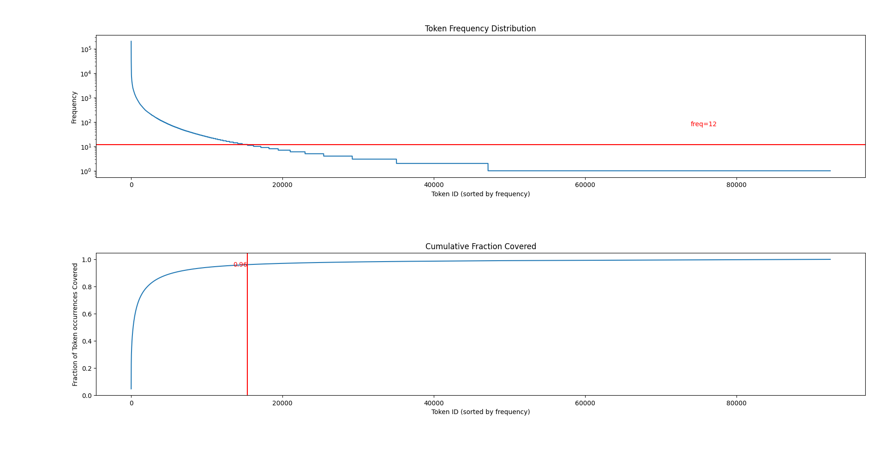
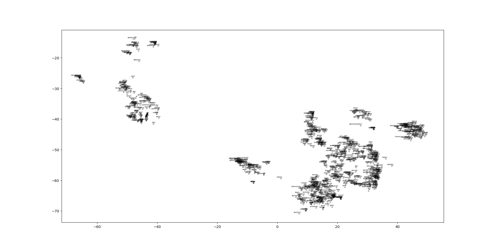
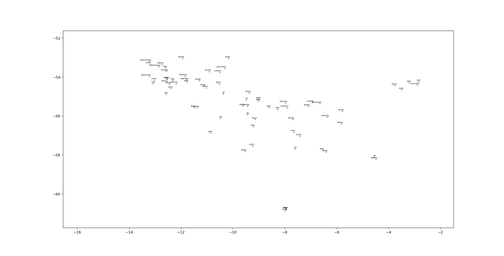
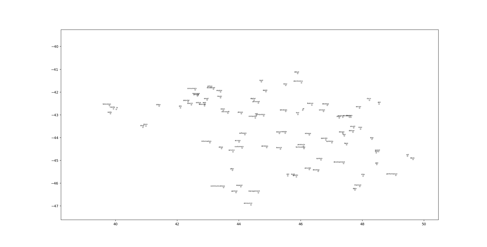
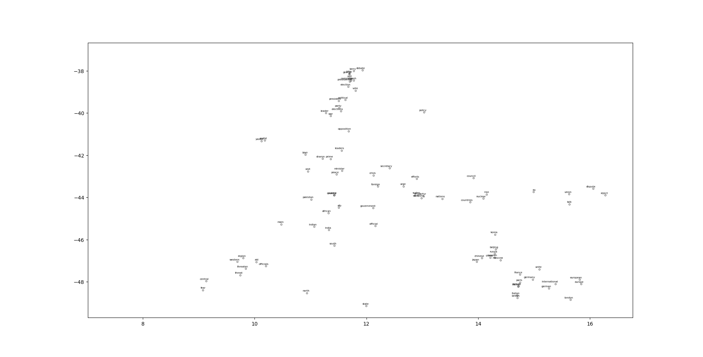

# Word Vectors in Natural Language Processing

This project builds word vectors from the [AG News](https://huggingface.co/datasets/ag_news) training split in two ways, then separately probes analogy queries on pretrained word2vec embeddings:

1. **Count-based vectors.** Tokenize, build a frequency-cutoff vocabulary, count document-level co-occurrences, convert the counts to PPMI, and reduce them with truncated SVD.
2. **Learned vectors.** Fit GloVe vectors to the same co-occurrence counts with minibatch SGD and momentum.
3. **Analogy queries.** Run analogy queries on the pretrained `word2vec-google-news-300` model, including queries that expose gendered associations.

The charts, training log, and analogy scores below are historical outputs from the original experiment. They have not been regenerated. A reviewed write-up is available at [kapshaul.github.io/studies/word-vector](https://kapshaul.github.io/studies/word-vector/).

## Files

| File | Role |
| --- | --- |
| [`Vocabulary.py`](Vocabulary.py) | `Vocabulary` class: tokenizer, frequency-cutoff vocabulary, and the frequency/coverage chart (Figure 1). Downloads the NLTK `punkt` and `wordnet` data on import. |
| [`build_freq_vectors.py`](build_freq_vectors.py) | Entry point for the count-based pipeline: vocabulary chart → co-occurrence matrix → PPMI → truncated SVD → t-SNE plot. Also defines `compute_cooccurrence_matrix` and `plot_word_vectors_tsne`, which the GloVe script reuses. |
| [`build_glove_vectors.py`](build_glove_vectors.py) | Entry point for GloVe training on the same co-occurrence matrix, followed by a t-SNE plot of the learned word vectors. |
| [`Exploring_learned_biases.py`](Exploring_learned_biases.py) | Downloads pretrained word2vec through `gensim` and prints 15 analogy queries. It does not use the AG News vectors. |
| [`requirements.txt`](requirements.txt) | Unpinned dependencies: `numpy`, `tqdm`, `datasets`, `matplotlib`, `scikit-learn`, `nltk`, `gensim`. |
| [`Figures/`](Figures/) | Historical plots `Figure_1.png` through `Figure_6.png`. None of the scripts writes image files. |

## Setup

```bash
git clone https://github.com/kapshaul/nlp-word-vectors.git
cd nlp-word-vectors
pip install -r requirements.txt
```

Python and package versions for the original run were not recorded, and `requirements.txt` is unpinned. At first use:

- `datasets` downloads AG News (120,000 training articles).
- `Vocabulary.py` runs `nltk.download('punkt')` and `nltk.download('wordnet')`. If tokenization raises a `LookupError`, check the named NLTK resource required by your installed version; the two downloads in the source may not cover it.
- `Exploring_learned_biases.py` downloads the `word2vec-google-news-300` model through `gensim.downloader`, which requires a separate large model download.

## Running

Run each script from the repository root:

```bash
python build_freq_vectors.py        # vocabulary chart, PPMI + SVD, t-SNE
python build_glove_vectors.py       # GloVe training, t-SNE
python Exploring_learned_biases.py  # pretrained word2vec analogies (stdout only)
```

Runtime behavior verified from the source:

- **Plot display depends on the Matplotlib backend.** The scripts call `plt.show()` and do not save figure files. The archived images have no recorded generating command or code revision.
- **`C.npy` is a cache.** `compute_cooccurrence_matrix` saves the matrix as `C.npy` in the working directory and reloads it on later runs, from either script, without checking that it matches the current vocabulary. Delete `C.npy` after changing the tokenizer or cutoff.
- **The vocabulary is rebuilt on every run.** Each script re-tokenizes the full training corpus. Building the co-occurrence matrix uses a pure-Python double loop over every token pair in every article, so the first run is slow.
- **Memory is dominated by dense V × V arrays.** `C` uses `dtype=int` (8 bytes per entry on typical 64-bit Linux/macOS builds), and the PPMI step creates several further floating-point V × V arrays. Memory therefore grows with the square of the vocabulary size.
- **Fixed seeds.** `random`, `numpy`, randomized SVD, and t-SNE are seeded with 42.

## Method and implementation

### 1. Tokenization and vocabulary

`Vocabulary.tokenize` lowercases the text, strips ASCII punctuation, splits it with NLTK `word_tokenize`, and lemmatizes each token as a verb with WordNet (for example, `says` → `say`). `build_vocab` sorts token types by frequency and finds the first type at which cumulative coverage of token occurrences reaches 96%. Every type whose frequency is at least that type's frequency is kept, and all remaining types map to a single `UNK` entry.

<div align="center">



**Figure 1**: Token frequency distribution (top) and cumulative fraction of token occurrences covered (bottom).

</div>

In the recorded run, the cutoff frequency was 12, and the retained vocabulary covered about 96% of token *occurrences*. This is not 96% of distinct word types, most of which are rare. The cutoff is computed from the data rather than hard-coded, so a different tokenizer or NLTK version can change it. The original report chose this coverage level so that the dense co-occurrence matrix stayed near 1 GB. That estimate applies only to the recorded vocabulary size and storage type.

### 2. Count-based vectors: co-occurrence, PPMI, and SVD

**Context definition.** Each news article is one context window. For every ordered pair of token positions in an article, including a position paired with itself, `C[i, j]` is incremented. The matrix is therefore symmetric, and the diagonal counts self-pairs.

**Intended PPMI.** With $N=\sum_{i,j}C_{ij}$,

$$
P(i,j)=\frac{C_{ij}}{N},\qquad P(i)=\frac{\sum_j C_{ij}}{N},\qquad P(j)=\frac{\sum_i C_{ij}}{N},\qquad
\operatorname{PPMI}(i,j)=\max\left(0,\log\frac{P(i,j)}{P(i)\,P(j)}\right).
$$

**What the code computes.** In [`build_freq_vectors.py`](build_freq_vectors.py) (line 108), `p_x * p_y` multiplies two length-V vectors element-wise. The result is a length-V vector, not the V × V outer product. When `p_xy` (V × V) is divided by it, NumPy broadcasts along the last axis, so each entry becomes

$$
\mathrm{PMI}_{\text{code}}(i,j)=\log\left(\frac{P(i,j)}{P_x(j)\,P_y(j)}+10^{-8}\right).
$$

Because `C` is symmetric, $P_x=P_y$, so the denominator is $P(j)^2$ rather than $P(i)P(j)$. The intended form would be `np.outer(p_x, p_y)` or `p_x[:, None] * p_y[None, :]`. The code has not been changed. The `1e-8` term maps zero counts to a large negative value that the positive clip then sets to zero.

**Dimensionality reduction.** `dim_reduce` runs `randomized_svd` with $k=16$ and concatenates $U_k\Sigma_k^{1/2}$ and $V_k\Sigma_k^{1/2}$. It then L2-normalizes each row, which produces 32-dimensional vectors.

**Visualization.** `plot_word_vectors_tsne` fits t-SNE (cosine metric, perplexity 50) to all vocabulary vectors. It then plots and labels the 1,000 most frequent vocabulary entries, which can include the `UNK` bucket.

<div align="center">



**Figure 2**: t-SNE projection of the reduced vectors from the PPMI pipeline.

<br>





**Figure 3**: t-SNE clusters: war (left), technology (middle), and politics (right).

</div>

<br>

These are historical figures; their exact generating code revision is not recorded. The current implementation has the PPMI limitation described above. t-SNE preserves local neighborhoods better than global layout. Cluster sizes and the distances between separated clusters are not direct measurements of the embedding geometry.

`Figures/Figure_6.png` is another t-SNE projection stored in the repository. The run that produced it (PPMI or GloVe) is not recorded, so it is not attributed to either pipeline here.

### 3. Learned vectors with GloVe

For every pair with $C_{ij}>0$, define the error

$$
e_{ij}=\mathbf w_i^\top\widetilde{\mathbf w}_j+b_i+\widetilde b_j-\log C_{ij}.
$$

$\mathbf w_i$ is the word vector for word $i$, $\widetilde{\mathbf w}_j$ is the context vector for word $j$, and $b_i$ and $\widetilde b_j$ are the corresponding biases. The objective is a weighted least-squares regression:

$$
J=\sum_{i,j\,:\,C_{ij}>0} f(C_{ij})\,e_{ij}^2,\qquad
f(x)=\min\left(1,\frac{x}{100}\right)^{0.75}.
$$

The weight $f$ keeps very frequent pairs from dominating the objective. Zero-count pairs are omitted because $\log 0$ is undefined.

**Gradients.** For a single pair $\ell_{ij}=f(C_{ij})e_{ij}^2$:

$$
\nabla_{\mathbf w_i}\ell_{ij}=2f(C_{ij})\,e_{ij}\,\widetilde{\mathbf w}_j,\qquad
\nabla_{\widetilde{\mathbf w}_j}\ell_{ij}=2f(C_{ij})\,e_{ij}\,\mathbf w_i,\qquad
\frac{\partial\ell_{ij}}{\partial b_i}=\frac{\partial\ell_{ij}}{\partial\widetilde b_j}=2f(C_{ij})\,e_{ij}.
$$

The gradient of the full objective sums these contributions over every pair that involves the parameter, for example $\nabla_{\mathbf w_i}J=\sum_{j:C_{ij}>0}2f(C_{ij})e_{ij}\widetilde{\mathbf w}_j$. The code computes the per-pair expressions for each minibatch row (`common_term = fval*error`).

**Training configuration** (hard-coded in `main_glove`):

| Setting | Value |
| --- | --- |
| Vector dimension `d` | 32 |
| Batch size `B` | 1024 word pairs |
| Epochs | 10 |
| Learning rate | 0.05 |
| Momentum `m` | 0.9 |
| Step clip | ±50, applied element-wise to `learningRate * momentum` |
| Initialization | Vectors uniform in [0, 1); biases `log(mean(C))` along rows/columns |

**Implementation behavior to be aware of:**

- **Repeated indices do not accumulate.** The momentum updates at lines 139–143 use NumPy advanced-index `+=`, for example `wordvecs_momentum[i,:] += ...`. When a token index appears more than once in the same batch, NumPy applies only one of those contributions, so the batch update undercounts gradients for frequent words. Accumulating would require `np.add.at`. The parameter updates at lines 147–151 likewise apply one step per unique row.
- **Sparse momentum.** Momentum buffers decay for every row at every batch, but parameters change only for rows present in the batch.
- **Reported loss.** The script prints `loss / (B * 100)` at every positive batch index divisible by 100. The first window includes indices 0–100 (101 batches) despite the 100-batch denominator; later windows contain 100 batches.
- **Only word vectors are plotted.** The final t-SNE plot uses the word vectors only, not word plus context vectors. The trained vectors are not saved.

The last lines of the recorded training log are reproduced below. `15227` is `idx.shape[0] // B`, so the run had between 15,592,448 and 15,593,471 non-zero co-occurrence entries. The log does not identify which epoch these lines came from. A flat segment of the loss curve does not by itself establish convergence or embedding quality.

```text
2024-04-17 04:09:49 INFO     Iter 14400 / 15227: avg. loss over last 100 batches = 0.046686563985831216
2024-04-17 04:09:49 INFO     Iter 14500 / 15227: avg. loss over last 100 batches = 0.04769956457112328
2024-04-17 04:09:49 INFO     Iter 14600 / 15227: avg. loss over last 100 batches = 0.04687950216720886
2024-04-17 04:09:49 INFO     Iter 14700 / 15227: avg. loss over last 100 batches = 0.04827717854832922
2024-04-17 04:09:49 INFO     Iter 14800 / 15227: avg. loss over last 100 batches = 0.047144581882744535
2024-04-17 04:09:49 INFO     Iter 14900 / 15227: avg. loss over last 100 batches = 0.047903630422071866
2024-04-17 04:09:49 INFO     Iter 15000 / 15227: avg. loss over last 100 batches = 0.04676183418646468
2024-04-17 04:09:49 INFO     Iter 15100 / 15227: avg. loss over last 100 batches = 0.048071157216658514
2024-04-17 04:09:49 INFO     Iter 15200 / 15227: avg. loss over last 100 batches = 0.04732485846561704
```

### 4. Analogy queries on pretrained word2vec

`Exploring_learned_biases.py` uses the pretrained Google News word2vec model, not the AG News vectors above. `analogy(a, b, c)` prints the top 10 results of

```python
w2v.most_similar(positive=[c, b], negative=[a])
```

This ranks words by cosine similarity to the combination $\hat{\mathbf v}_b-\hat{\mathbf v}_a+\hat{\mathbf v}_c$ of unit-normalized vectors. gensim's `most_similar` also **excludes the query words themselves** from the results. The script runs 15 queries: a standard example, three analogies expected to work, three expected to fail, four stock gender examples, and four more gender queries (`marine`, `delicate`).

The recorded outputs of the two medical queries were:

```python
>>> analogy('man', 'doctor', 'woman')
    man : doctor :: woman : ?
    [('gynecologist', 0.709), ('nurse', 0.648), ('doctors', 0.647), ('physician', 0.644), ('pediatrician', 0.625), ('nurse_practitioner', 0.622), ('obstetrician', 0.607), ('ob_gyn', 0.599), ('midwife', 0.593), ('dermatologist', 0.574)]

>>> analogy('woman', 'doctor', 'man')
    woman : doctor :: man : ?
    [('physician', 0.646), ('doctors', 0.586), ('surgeon', 0.572), ('dentist', 0.552), ('cardiologist', 0.541), ('neurologist', 0.527), ('neurosurgeon', 0.525), ('urologist', 0.525), ('Doctor', 0.524), ('internist', 0.518)]
```

The two lists are asymmetric. The `woman` query ranks `nurse`, `midwife`, and women's- and children's-health specialties highly, and the `man` query ranks `surgeon` and several other specialties. This matches the gendered associations reported in the embedding-bias literature and is a reason to look further.

**What these outputs do and do not show.** Analogy queries on their own are not a bias measurement:

- `doctor` is excluded from its own results, so the query cannot return "doctor" even if that were the nearest vector. Results are pushed toward neighboring words.
- The scores are cosine similarities to a vector combination, not probabilities or statements about people. Near-synonyms `doctors` and `physician` appear in both lists; `Doctor` appears only in the second.
- A handful of hand-picked queries does not estimate how widespread an association is across the vocabulary, how it compares with a baseline, or where it comes from in the Google News training data.

A bias claim needs a defined measurement, such as a set of target and attribute words with a significance test or a projection onto a learned bias direction, applied systematically. That is beyond what this script does. The other 13 queries print only to stdout, and their outputs were not recorded.

## Known limitations

- The current PPMI code uses the broadcast denominator $P(j)^2$ instead of $P(i)P(j)$ (see §2); the precise generating revision of Figures 2–5 is not recorded.
- GloVe momentum updates drop repeated-index contributions within a batch (see §3).
- Co-occurrence contexts are whole articles and include self-pairs, so the diagonal of `C` grows with the square of a word's in-document frequency.
- `C.npy` is reused without validation, plots are never saved, and trained vectors are never written to disk.
- Dependency versions are unpinned, and the historical outputs have not been reproduced in a fresh run.
